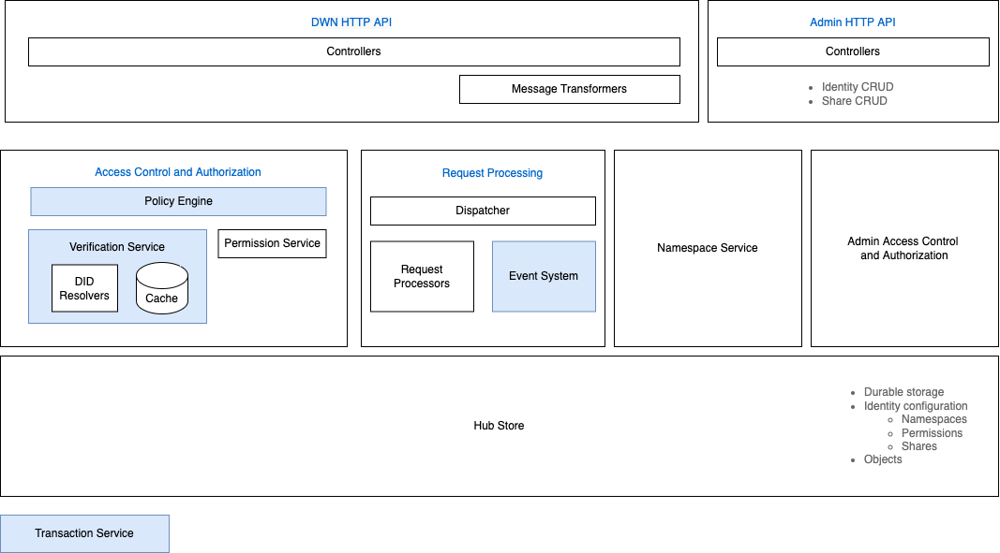
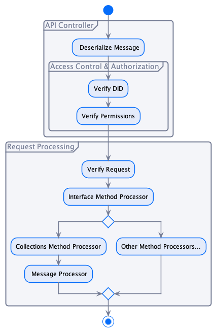

# Identity Hub Technical Specification

## I. Overview

This document serves as a technical specification for the __*Identity Hub*__. An identity hub is a credential storage and message relay system run by a participant. The hub is intended to serve as a foundation for participant messaging protocols in a dataspace. In particular, the identity hub will be used to securely deliver verifiable credentials from a __dataspace issuer__ to a __dataspace participant__. The hub will also be used to provide verifiable presentations on behalf of a participant. 

The Identity Hub will support relevant parts of the [Decentralized Web Node specification (DWN)](#decentralized-web-node-specification). It should also be possible to support other APIs in the future, if required.

The identity hub will be written in Java using the EDC modularity and extensibility framework and be placed in its own GitHub repository. The current Identity Hub implementation will be pulled out of the EDC repository and serve as a starting point for the current implementation.

## II. Deployment Topologies

Participants may adopt different [Participant Identity Topologies](../participant-identity-topologies.md) where a single organization owns multiple identities. The identity hub will support these topologies in conjunction with the following deployment scenarios.

#### 1. Collocated Test Deployment
In this scenario, a developer or demo may chose to collocate the identity hub and all participant agents (e.g. Connector, FCN, FCC) in a single process. The identity hub will leverage the EDC to deploy as a set of extensions to a common runtime.  This topology is not intended for production use.  

#### 2. Single Service Deployment
In this scenario, an organization wishes to manage credentials and identity-related messages through a single software infrastructure deployment. The identity hub will be be deployed as a standalone service (single process or clustered) that operates on behalf of multiple participant agent identities. For example, multiple connector deployments 

#### 3. Multiple Service Deployment 
In this scenario, an organization distributed its identity management across independent deployments. Each deployment will manage credentials for specific identities. The identity hub will be deployed as multiple independent services (single process, clustered, or a combination).

#### Deployment Considerations
Like other EDC services, the identity hub is designed to be run on-premise, in the cloud, as part of a cluster, on constrained devices, or in a servlerless environment (e.g., Azure Functions or AWS Lambda). This entails attention to startup time, minimal dependencies, and an optimized process footprint.

## III. Capabilities

The hub will support the following capabilities. Note that many of these capabilities will not be completed as part of the first phases of the MVD.  

#### 1. Namespaces
In order to support [Deployment Topology 2](#2-single-service-deployment) and [Deployment Topology 3](#3-multiple-service-deployment), the identity hub will implement the concept of namespaces. 

> __Definition__ 
>A __*namespace*__ is a region of access associated with an identity managed by the hub, where each identity has a namespace. 

When an identity (DID) is registered in the system, a namespace will be implicitly created. All non-admin hub operations are performed in the context of a namespace. For example, queries and writes take place in the context of a namespace. 

A namespace has a set of __*permissions*__ that determine if a client is authorized to make a request against a namespace. The DID owner has the following privileges against its namespace:

1. Execute all hub request types 
2. Grant permissions to specific clients 

The DID owner does __not__ have admin privileges (e.g. delete) against its namespace.   

#### 2. Permissions 
Permissions are based on the [DWN specification](#1-decentralized-web-node-specification).

>__Issues to track__ 
https://github.com/decentralized-identity/decentralized-web-node/issues/142
https://github.com/decentralized-identity/decentralized-web-node/issues/137

#### 3. Hub API
The hub will support binding operations to a RESTful HTTP API.

##### Request Interfaces
The following DWN interfaces will be supported:

1. [Feature Detection](https://identity.foundation/decentralized-web-node/spec/#feature-detection)
1. [Collections](https://identity.foundation/decentralized-web-node/spec/#collections)
1. [Permissions](https://identity.foundation/decentralized-web-node/spec/#permissions)

Note that the [Threads](https://identity.foundation/decentralized-web-node/spec/#threads) and [Sync](https://identity.foundation/decentralized-web-node/spec/#sync) interfaces will not be supported.

The hub will only support the [Last Write Wins](https://identity.foundation/decentralized-web-node/spec/#last-write-wins) commit strategy.

##### Namespace Mapping
The HTTP API will map requests to the associated DID owner (and namespace) based on the request path using the DID method specific identifier according to the following pattern:

`https://[base URL]/did-method-specific-identifier`

> __Question__: Is it OK to only rely on the method-specific identifier or does the DID method need to be included?

#### 4. Management API
The hub will provide a secured management API to perform the following operations:

1. Create and delete an identity namespace.

The management API should use the authentication wrappers provided by the EDC Data Management API.

#### 5. Extensibility
The DWN specification enumerates a set of *Interfaces* that define request types a client can make, for example a collection query or permission grant. The *Collections* interface type defines operations for exchanging *Message Objects* with a hub. The hub will define extensibility points for supporting interface types and messaging object types. The specifics of these extensibility points are detailed in the [Request Processing section](#request-processing). 

## IV. System Architecture

The following diagram depicts the main hub subsystems. Modules shaded in blue are repurposed from the core EDC extensions:

#### DWN HTTP API
The HTTP API is responsible for marshalling client requests from the HTTP transport, performing security checks, and dispatching to the request processing subsystem. It will be developed as an EDC extension using JAX-RS controllers. Performing security checks will involve delegating to other services for: (1) mapping the request to a *namespace*; (2) verifying the client request token; (3) and evaluating the client's permissions to perform the requested operation. 

#### Namespace Service
The `NamespaceService` is responsible for namespace CRUD operations. It will delegate to an extensible `HubStore` for durable storage. 

#### Access Control and Authorization
This subsystem will be composed of extensions that verify a client token and perform permission checks against a mapped namespace. Client token verification should be based on the existing EDC distributed identity service (which may require modification). If DID resolution performance becomes an issue, adding a resolved DID document cache can be investigated.

The EDC policy evaluator is currently planned to be used as the basis for permission evaluation.

 
#### Request Processing
The request processing pipeline is the central dispatch mechanism in the hub. It is transport agnostic and receives requests after they have been de-marshalled by an API controller. The following diagram depicts the request processing flow:

The `RequestProcessingService` will dispatch to an `InterfaceMethodProcessor` based on interface type of the incoming `method` field of of each message in the request (requests contain an array of message objects). 

Collection method processors may need to dispatch to a `MessageProcessor` based on the message `descriptor` for additional handling. For example, a collection query could specify a request for a verifiable presentation that includes a [derived predicate](https://www.w3.org/TR/vc-data-model/#dfn-predicates). A `MessageHandler` will need to be present to retrieve verifiable credentials from the `HubStore` and generate a Verifiable Presentation containing the appropriate derived predicate.

> __Issue__ 
Dispatching to a `MessageProcessor` will be done based on the message `descriptor`. However, the precise mechanics of how this is done and support for default processors still needs to be worked out.  

##### Events
The EDC observability and eventing system (work in progress) will be leveraged to generate events based on performed operations. For example, an event will be generated when a credential is received and stored. These events will be used by other services in the MVD to perform follow-up actions.

Some observability callbacks may need to be performed transactionally, for example, when an object is stored. The hub will make use of the EDC `TransactionContext` for this purpose.

#### Extensibility Points

The following are a list of architected hub extensibility points:

1. Hub API
    - Decentralized Web Node API bound to HTTPS
1. Authentication and Authorization
    - Not tied to Web DIDS.
1. Request handling and message processing
    - Support additional interface methods
    - Support message data processing, transformation, and generation 
1. Hub storage
1. Notifications and Events

## Bibliography 

##### Decentralized Web Node Specification 
https://github.com/decentralized-identity/decentralized-web-node

##### Verifiable Credentials Data Model
https://www.w3.org/TR/vc-data-model/

##### Presentation Exchange
https://identity.foundation/presentation-exchange

##### Credentials Manifest
https://identity.foundation/credential-manifest

##### tbDEX 
An example of a hub-based messaging protocol.

https://github.com/TBD54566975/tbdex-protocol
https://github.com/TBD54566975/tbdex-whitepaper/blob/main/whitepaper.pdf

## Open Issues

#### Object Id storage
The object id may need to include the interface name, id (https://github.com/decentralized-identity/decentralized-web-node/issues/147).

#### Designing a Dataspace Protocol 

We need to design a proper dataspace protocol instead of using hub events for things such as notifying a participant of a successful registration. 

#### Sharing
Consider the following use case. An organization applies for membership in a dataspace, is accepted, and receives a verifiable credential attesting to its role as a participant. The organization opts to setup independent connector deployments where each one uses a distinct DID. This is due to the requirement that each deployment has different credentials. How is the credential associated with the organization DID chained to the connector DIDs? Also, how is the credential stored. One option would be to introduce the concept of a *share* where one namespace can share an object with another namespace.

