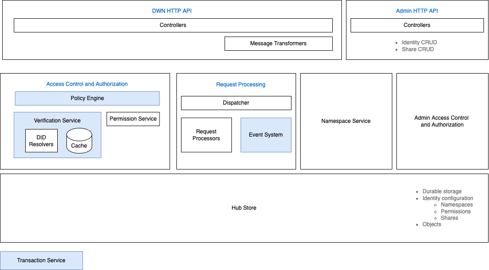

# Identity Hub Technical Specification

## Overview

The document serves as a technical specification for the __*Identity Hub*__. An identity hub is a credential storage and message relay system run by a participant. The hub is intended to serve as a foundation for participant messaging protocols in a dataspace. In particular, the identity hub will be used to securely deliver verifiable credentials from a __dataspace issuer__ to a __dataspace participant__. The hub will also be used to provide verifiable presentations on behalf of a participant. 

The Identity Hub will support relevant parts of the [Decentralized Web Node specification (DWN)](#1-decentralized-web-node-specification). It should also be possible to support other APIs in the future, if required.

The identity hub will be written in Java using the EDC modularity and extensibility framework and be placed in its own GitHub repository. The current Identity Hub implementation will be pulled out of the EDC repository and serve as a starting point for the current implementation.

## Deployment Topologies

Participants may adopt different [Participant Identity Topologies](../participant-identity-topologies.md) where a single organization owns multiple identities. The identity hub will support these topologies in conjunction with the following deployment scenarios.

#### 1. Collocated Test Deployment
In this scenario, a developer or demo may chose to collocate the identity hub and all participant agents (e.g. Connector, FCN, FCC) in a single process. The identity hub will leverage the EDC to deploy as a set of extensions to a common runtime.  This topology is not intended for production use.  

#### 2. Single Service Deployment
In this scenario, an organization wishes to manage credentials and identity-related messages through a single software infrastructure deployment. The identity hub will be be deployed as a standalone service (single process or clustered) that operates on behalf of multiple participant agent identities. For example, multiple connector deployments 

#### 3. Multiple Service Deployment 
In this scenario, an organization distributed its identity management across independent deployments. Each deployment will manage credentials for specific identities. The identity hub will be deployed as multiple independent services (single process, clustered, or a combination).

#### Deployment Considerations
Like other EDC services, the identity hub is designed to be run on-premise, in the cloud, as part of a cluster, on constrained devices, or in a servlerless environment (e.g., Azure Functions or AWS Lambda). This entails attention to startup time, minimal dependencies, and an optimized process footprint.

## Capabilities

The hub will support the following capabilities. Note that many of these capabilities will not be completed as part of the first phases of the MVD.  

#### Namespaces
In order to support [Deployment Topology 2](#2-single-service-deployment) and [Deployment Topology 3](#3-multiple-service-deployment), the identity hub will implement the concept of namespaces. 

> __Definition__ 
>A __*namespace*__ is a region of access associated with an identity managed by the hub, where each identity has a namespace. 

When an identity (DID) is registered in the system, a namespace will be implicitly created. All non-admin hub operations are performed in the context of a namespace. For example, queries and writes take place in the context of a namespace. 

A namespace has a set of __*permissions*__ that determine if a client is authorized to make a request against a namespace. The DID owner has the following privileges against its namespace:

1. Execute all hub request types 
2. Grant permissions to specific clients 

The DID owner does __not__ have admin privileges (e.g. delete) against its namespace.   

#### Permissions 
Permissions are based on the based the [DWN specification](#1-decentralized-web-node-specification).

#### Hub API
The hub will support an HTTP API based on the DWN specification. The following DWN interfaces will be supported

1. [Feature Detection](https://identity.foundation/decentralized-web-node/spec/#feature-detection)
1. [Collections](https://identity.foundation/decentralized-web-node/spec/#collections)
1. [Permissions](https://identity.foundation/decentralized-web-node/spec/#permissions)

Note that the [Threads](https://identity.foundation/decentralized-web-node/spec/#threads) and [Sync](https://identity.foundation/decentralized-web-node/spec/#sync) interfaces will not be supported.

The hub will only support the [Last Write Wins](https://identity.foundation/decentralized-web-node/spec/#last-write-wins) commit strategy.

#### Management API
The hub will provide a management API to perform the following operations:

1. Create and delete an identity namespace.

## System Architecture

Extensibility Points
1. Hub APIs
- Decentralized Web Node API bound to HTTPS
- Extensible using EDC mechanisms
2. Backing Stores

3. Request Processing
a. Request Handler
- Transformation to Verifiable Presentation
- Transport independent processing pipeline

b. Validation
default validation, validation by type

c. Notification/Events (Request processing)
- Transport independent
- by type
- Fired as part of request processing 
- Motivation - support notification when an event is received (e.g. VC)

## Bibliography 

##### 1. Decentralized Web Node Specification 
https://github.com/decentralized-identity/decentralized-web-node

-----------------

#### Sharing case!!!!!!!!!
Consider the following use case. An organization applies for membership in a dataspace, is accepted, and receives a verifiable credential attesting to its role as a participant. The organization opts to setup independent connector deployments where each one uses a distinct DID. This is due to the requirement that each deployment has different credentials. 

The dataspace issuer that provides the participant credential 

Open issues: 

1. Are shares necessary?
1. How would shares work across deployments?

-------------
1. How to handle VC propagation: e.g. parent company has a V.C., VC1:

1. Parent company adds a VS to the participant's hub. The parent's DID can be resolved, it's identity hub located, and the VC1 resolved.
2. Shares
3. Manual copy

