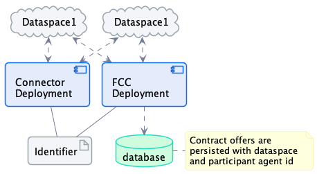
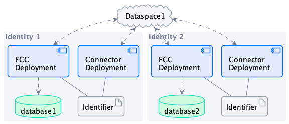
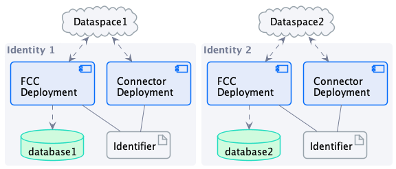

# Identity Topologies

This document enumerates the possible participant *__identity topologies__* in a dataspace. Note that identity topologies are independent of the underlying identity technology used by the dataspace (e.g. centralized or decentralized).     

## 1..N Topology: One Identifier, Multiple Dataspaces

In this scenario, a one identifier is used by all __participant agents__. A single connector deployment and single FCC deployment can operate against multiple dataspaces.

 
Note that crawled contract offers will need to be disambiguated by dataspace *__and__* participant since it is insufficient to track offers by participant id alone. For example, it must be possible to determine the offers available by dataspace. 

## N..1 Topology: Multiple Identifiers, One Dataspace

In this topology, a single participant deploys multiple agents with different identifiers. Participant agents will therefore consist of isolated deployments:

## N..N Topology: Multiple Identifiers, Multiple Dataspaces

In this topology, a single participant deploys multiple agents with different identifiers, each communicating with different dataspaces. Participant agents will therefore consist of isolated deployments:

