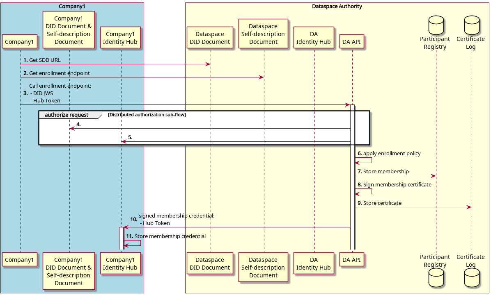
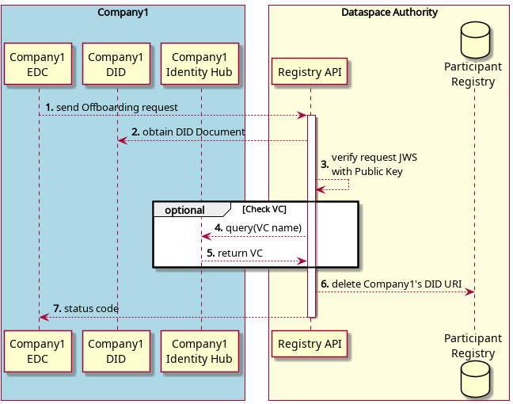
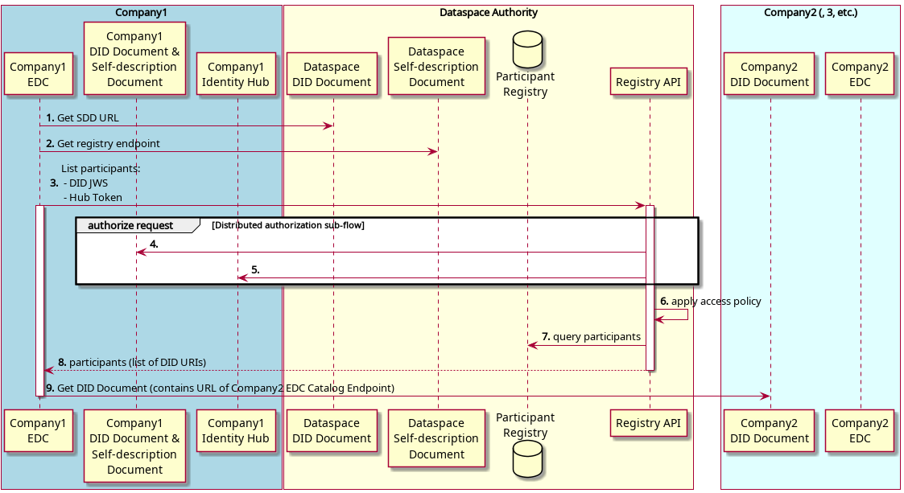

# Registration Service - Technical Specification 

For the sake of this document, we'll use the terms "Registration Service" and "Dataspace Authority"

## Requirements
- must have its own did:web

## Data models

## Architecture

## Operations
### 1. Onboarding

#### Participants

1. Company1, an entity which intends to become a Dataspace participant
2. The Dataspace Authority, which manages the enrollment process

#### Overview

A Client for Company1 initiates the enrollment process by resolving and contacting the enrollment API endpoint for the Dataspace Authority. The client could be e.g. a CLI utility.

The Dataspace Authority enrollment service obtains Verifiable Credentials from Company1 to determine whether it meets enrollment policies. The enrollment service then issues a Verifiable Credential that establishes membership and pushes it to Company 1's Identity Hub, and stores membership and certificate information.

In simple scenarios, enrollement could be fast and fully automated. However, in advanced scenarios, enrollment policies could require interactions with external systems, and even manual processes. Therefore, it is implemented asynchronously.

#### Pre-conditions

1. A root CA is established and trusted by all participants. (Intermediate CAs are out of scope in this simplified discussion)
2. Company1 knows the DID URL of the Dataspace it intends to join.
3. The Dataspace Authority Identity Hub contains a VC signed by the root CA, establishing the Dataspace Authority DID as the effective Dataspace Authority for Dataspace D.
4. The Company1 Identity Hub contains VCs that satisfy the Dataspace Authority enrollment policy. For example, it could be a credential signed by the German Government that establishes Company1 to be based in Germany, and a credential signed by Auditor1 that establishes Company1 to be ISO27001 certified.

#### Post-conditions

1. The Company1 Identity Hub contains a VC (X.509 certificate) signed by the Dataspace Authority, that establishes membership in Dataspace D. This is used by other participants to authorize requests from Company1.
2. The X.509 certificate is stored in the Dataspace Authority Certificate Log. This is used for auditing and revocation.
3. The Company1 DID URL is stored in the Dataspace Authority Participant Registry. This is used to serve participant requests.

#### Flow sequence

1. The Client for Company1 initiates the enrollment process based on the Dataspace DID URL. It retrieves the DID Document, and parses it to determine the Self-description document endpoint.
2. The Client for Company1 retrieves the Self-description document, and parses it to retrieve the Dataspace enrollment HTTP endpoint.
3. The client needs access to the Company1 Private Key to sign a JWS. The client sends an HTTP request to the Dataspace Authority enrollement endpoint. The request is accepted for asynchronous processing.
4. The DA uses the Distributed authorization sub-flow (see above) to authenticate the request...
5. ... and retrieve credentials from Company1's Identity Hub.
6. The DA authorizes the request by applying the Dataspace enrollment policy on the obtained Verifiable Credentials.
7. The DA stores membership information in its registry. At the very least, this includes Company 1's DID URL.
8. The DA issues and signs a membership Verifiable Credential as an X.509 Certificate.
9. The DA stores the Certificate in its log, for audit and revocation.
10. The DA sends the Verifiable Credential to Company1's Identity Hub for storage. It uses the Identity Hub bearer token (from the Distributed authorization sub-flow) to authenticate the request.
11. Company1's Identity Hub validates the bearer token and stores the membership Verifiable Credential.

### 2. Offboarding

#### Participants
1. Company1, an entity which intends to offboard, i.e leave the datasapce
2. The Dataspace Authority, which manages the members list

#### Overview
Company1 initiates the offboarding process by sending a request to the offboarding API of the Dataspace Authority. This request contains the DID URI signed with Company1's private key. The Dataspace Authority must make verify the identity of Company1 by resolving the DID and verifying the signature. 

_As an additional security measure the request could also contain any one of Company1's VCs, which the Dataspace Authority must then query from Company1's IdentityHub and check for equality._

Company1 can choose to re-onboard anytime, assuming all conditions in that flow are still met.

#### Pre-conditions
1. Company1 is a member of the Dataspace, i.e. the Dataspace Authority contains Company1's DID URI in its member list.
2. Company1 is not blacklisted
3. [optional] Company1 has an Identity Hub that contains at least one VC.

#### Post-conditions
1. Dataspace Authority does not have Company1's DID URI in its member list anymore.

#### Flow sequence

### 3. Blacklisting
todo

### 4. Get Member List

#### Participants

1. Company1, a Dataspace Participant with an EDC application that wants to discover participants (for instance, in order to query contract offers)
2. The Dataspace Authority, which manages the participant registry
3. Company2, Company3, etc., Dataspace Participants

#### Overview

A typical EDC deployment caches contract offers from other participants in a federated catalog, so that users can quickly browse and negotiate contracts. To regularly retrieve offers, it regularly contacts the Dataspace Registry to refresh its list of Dataspace Participants, then obtains contract offers from each participants to refresh its cache.

In this flow, the EDC for Company1 obtains a list of Dataspace Participants and resolves their IDS endpoints. Using these IDS endpoints (e.g. for listing contract offers) is outside the scope of this flow..

#### Pre-conditions

1. Participants are registered as (currently valid) Dataspace Participants

#### Post-conditions

None

#### Flow sequence

1. The EDC for Company1 determines the Self-description document endpoint from the Dataspace DID Document.
2. The EDC for Company1 determines the Dataspace Registry endpoint from the Self Description document.
3. The EDC for Company1 issues a request to the Dataspace Registry, to list participants.
4. The Registry uses the Distributed authorization sub-flow (see above) to authenticate the request...
5. ... and retrieve credentials from Company1's Identity Hub.
6. The Registry authorizes the request by applying the Registry access policy on the obtained Verifiable Credentials. For example, the caller must be a valid Dataspace Participant.
7. The Registry obtains the list of Dataspace Participant DID URIs from its storage...
8. ... and returns it synchronously to the caller (Company1 EDC).
9. The EDC for Company1 iterates through the list of DID URIs, retrieves the corresponding DID documents, and from it resolves each participant's Self Description document. The Self Description document contains all relevant information such as IDS endpoints.

_Note: Steps 1 - 2 could be cached_